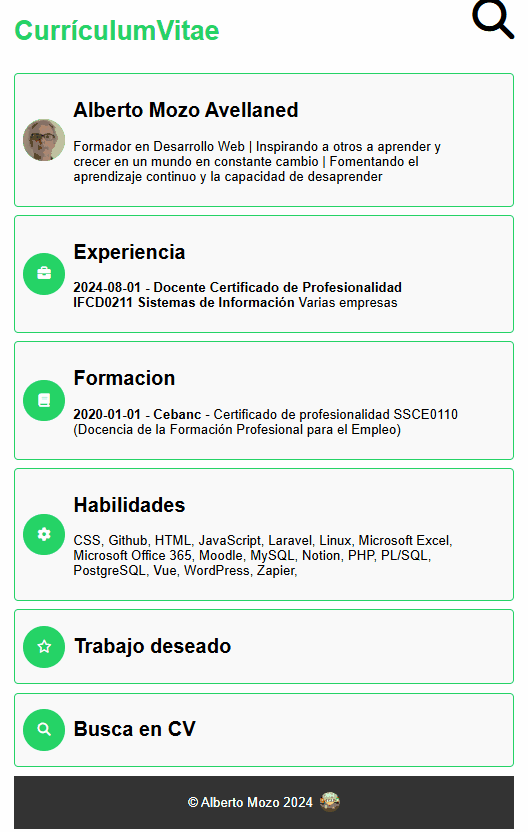

# CV estilo WhatsApp

Este proyecto permite generar un currículum con un estilo visual similar al de WhatsApp, utilizando datos extraídos de un archivo JSON. La idea es que los usuarios puedan modificar el archivo JSON, usando un formato estandarizado como el que ofrece [Manfred](http://www.getmanfred.com), y que los cambios se reflejen automáticamente en el CV visual. También es un reto para que exploren la posibilidad de aplicar este método a otros estilos.
EL proyecto esta disponible en : [https://cvalberto.netlify.app](https://cvalberto.netlify.app)

## Características

- **Formato de JSON**: Usa un archivo JSON que contiene la información del CV en un formato normalizado. Este JSON se puede exportar directamente desde tu perfil de LinkedIn a través de Manfred.
- **Estilo WhatsApp**: La interfaz simula el estilo visual de WhatsApp, lo que ofrece un diseño intuitivo y moderno.
- **Buscador de terminos**: Se pueden realizar busquedas sobre el contenido del JSON
- **Fácil personalización**: Los usuarios pueden reemplazar el JSON con su propia información y obtener una vista previa instantánea de su CV.
- **Uso de https://simpleicons.com**: Los iconos de los enlaces de datos personales se obtirnr online a trabes del nombre
- **logos skill**: Para los iconos de los skill, uso imagenes descargadas en a carpeta img/logos. Estospensando en implementar la funcionalidad preparada para los datos personales en esta sección. Pero muchas habilidades no tienen SVG en simpleicons. 
- **Reto de estilos**: El proyecto plantea un reto adicional para que los usuarios creen nuevos estilos visuales para su CV basados en otros temas.

## Requisitos previos

1. Obtener un archivo JSON de Manfred con tus datos. [Página https://getmanfred.com ](https://www.getmanfred.com).
2. Descargar o clonar el siguiente repositorio. 
3. Modificar datos.js colocando el JSON  de tu curriculum en lugar del descargado. 

## Reto adicional: Crea tu propio estilo
Una vez que tengas tu CV funcionando con el estilo de WhatsApp, intenta crear un nuevo estilo con estos pasos:

Diseño de interfaz: Crea un nuevo diseño visual para el CV (por ejemplo, estilo "Instagram" o "LinkedIn").
CSS personalizado: Usa CSS para replicar el estilo visual deseado.
Integración: Adapta el código para que se aplique tu nuevo estilo, manteniendo la estructura JSON.

## Contribuciones
Este proyecto está abierto a contribuciones. Si deseas añadir funcionalidades, optimizar el código o crear nuevos estilos de CV, ¡serás bienvenido!

## Licencia
MIT

version 1.1 

## mejoras de la proxima versión

Mejorar el buscador para que muestre tambien busquedas en documentos adjuntos como titulos, certificados,  etc 

Añadir formulario de contacto
